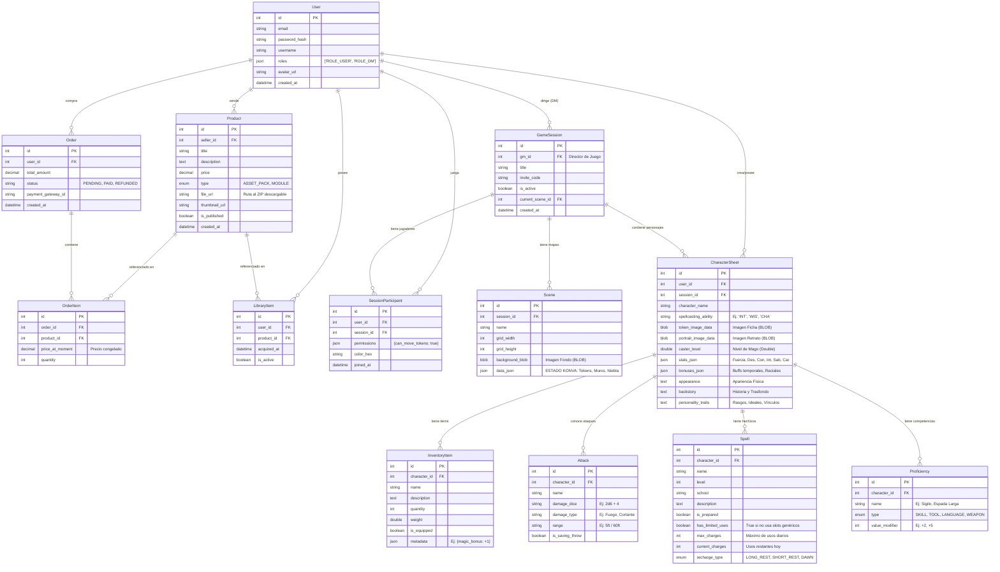

# Especificación Técnica: Plataforma VTT (Virtual Tabletop) & Marketplace

**Proyecto:** Trabajo de Fin de Grado (TFG) - Ingeniería Informática
**Versión del Documento:** 1.0.0
**Estado:** Definición de Arquitectura

---

## 1. Introducción

El presente documento establece las especificaciones técnicas para el desarrollo de una plataforma web integral orientada a la gestión y simulación de juegos de rol de mesa (RPG) en línea. El sistema, denominado **[Nombre de tu Proyecto]**, combina un Tablero Virtual (VTT - *Virtual Tabletop*) en tiempo real con un Marketplace de contenidos digitales.

El propósito principal es centralizar el ecosistema de juego, permitiendo a los usuarios adquirir módulos de aventura y activos gráficos (mapas, tokens) y utilizarlos inmediatamente dentro de una interfaz de juego interactiva y sincronizada.

## 2. Objetivos del Proyecto

1.  **Sincronización en Tiempo Real:** Implementar una comunicación bidireccional de baja latencia para reflejar el movimiento de fichas y tiradas de dados instantáneamente entre todos los participantes.
2.  **Renderizado Gráfico Avanzado:** Desarrollar un motor gráfico web capaz de gestionar múltiples capas, iluminación dinámica (niebla de guerra) y manipulación de objetos mediante Canvas.
3.  **Persistencia Híbrida:** Diseñar un modelo de datos que combine la integridad referencial para transacciones comerciales con la flexibilidad de estructuras NoSQL (JSON) para el estado del tablero.
4.  **Ecosistema de Contenidos:** Facilitar la integración automática de productos comprados (aventuras pre-diseñadas) directamente en las sesiones de juego del usuario.

## 3. Arquitectura del Sistema

El sistema sigue un patrón de arquitectura **Headless** y orientada a servicios, desacoplando completamente la lógica de negocio de la interfaz de usuario.

### 3.1 Diagrama de Componentes

* **Cliente (Frontend):** Aplicación SPA (Single Page Application) que consume la API REST y se conecta al Hub de eventos.
* **Servidor (Backend API):** Expone endpoints REST para la gestión de usuarios, productos y persistencia de partidas.
* **Hub de Tiempo Real:** Servicio independiente encargado de distribuir las actualizaciones de estado a los clientes conectados.
* **Base de Datos:** Almacenamiento persistente de información relacional y semi-estructurada.

## 4. Stack Tecnológico

La selección de tecnologías responde a criterios de rendimiento, escalabilidad y modernidad en el desarrollo web.

| Capa | Tecnología Seleccionada | Justificación Técnica |
| :--- | :--- | :--- |
| **Frontend** | **React.js** | Librería líder para interfaces reactivas. Facilita la gestión del estado complejo de la UI del juego. |
| **Motor Gráfico** | **Konva.js** | Abstracción de alto rendimiento para **HTML5 Canvas**. Permite manejo de eventos en objetos gráficos, drag-and-drop y capas, esencial para un VTT. |
| **Backend** | **Symfony 6/7 (PHP 8)** | Framework robusto que garantiza buenas prácticas (Inyección de Dependencias, SOLID). Uso de **API Platform** para agilizar el desarrollo REST. |
| **Tiempo Real** | **Mercure Hub** | Protocolo basado en **Server-Sent Events (SSE)**. A diferencia de WebSockets tradicionales, es nativo en el ecosistema Symfony, gestiona la reconexión automática y es compatible con HTTP/2. |
| **Base de Datos** | **MySQL / MariaDB** | Soporte sólido para transacciones ACID (necesarias para el Marketplace) y excelente manejo de tipos de datos JSON nativos. |
| **Infraestructura** | **Docker** | Contenerización de servicios (PHP, Nginx, Database, Mercure) para garantizar paridad entre desarrollo y producción. |

## 5. Funcionalidades por Rol de Usuario

El sistema implementa un control de acceso basado en roles (RBAC) diferenciados:

### A. Jugador (Player)
* Acceso a salas mediante sistema de invitación/enlace.
* Interacción con el tablero: Movimiento de tokens propios, medición de distancias.
* Hoja de personaje digital con actualización en tiempo real.
* Chat de texto y log de tiradas de dados 3D.

### B. Director de Juego (Game Master - DM)
* **Gestión de Salas:** Creación, pausado y guardado de sesiones.
* **Editor de Mapas:** Carga de imágenes de fondo, definición de grid y barreras de visión.
* **Control Total:** Capacidad para mover cualquier ficha y gestionar la visibilidad de las capas.
* **Importación:** Carga automática de "Módulos Integrados" comprados en la tienda.

### C. Creador de Contenido (Seller)
* Subida de activos digitales (Packs de imágenes, Módulos de aventura).
* Gestión de precios y descripción de productos.
* Dashboard de ventas.

### D. Administrador
* Gestión de usuarios y resolución de incidencias.
* Moderación de contenidos en el Marketplace.

## 6. Modelo de Datos (Enfoque Híbrido)

Para optimizar el rendimiento, se utiliza una estrategia mixta de almacenamiento.

### 6.1 Modelo Relacional (SQL)


### 6.2 Modelo NoSQL / JSON (Estado del Juego)
Debido a la complejidad y variabilidad de un tablero de juego (cientos de coordenadas, estados de niebla, notas), el estado de la partida se almacena como un documento JSON dentro de la tabla `GameSession` o una tabla satélite `MapState`.

**Ejemplo de estructura JSON almacenada:**
```json
{
  "mapId": 105,
  "fogOfWar": "polygons_base64_string...",
  "tokens": [
    { "id": "t_1", "x": 400, "y": 350, "rotation": 90, "layer": "characters" },
    { "id": "t_2", "x": 120, "y": 200, "isHidden": true, "layer": "enemies" }
  ]
}
```
## 7. Flujo de Comunicación (Tiempo Real)

El ciclo de vida de una interacción en el tablero sigue el siguiente flujo secuencial:

1.  **Acción:** El Usuario A mueve una ficha en el Canvas (**Frontend**).
2.  **Petición:** React envía una petición `POST /api/game/move` a **Symfony** con las nuevas coordenadas.
3.  **Validación:** Symfony valida que el movimiento es legal (comprobación de colisiones y permisos de usuario).
4.  **Persistencia:** Symfony actualiza el estado `JSON` en la Base de Datos.
5.  **Publicación:** Symfony envía una notificación asíncrona al **Mercure Hub** (topic: `/game/{id}`).
6.  **Distribución:** Mercure envía el evento (Server-Sent Event) a todos los clientes suscritos (Usuario B, C, DM).
7.  **Reacción:** El cliente React de los otros usuarios recibe el evento y **Konva.js** anima la ficha a la nueva posición sin recargar la página.

## 8. Planificación del Desarrollo

**Fase 1: Configuración (Semanas 1-2):** Setup de Docker, Symfony y diseño de DB.

**Fase 2: Core VTT (Semanas 3-7):** Implementación de Konva.js, lógica de tablero y sincronización Mercure.

**Fase 3: Marketplace (Semanas 8-10):** CRUD de productos, carrito y asociación de compras a usuarios.

**Fase 4: Integración (Semanas 11-12):** Conexión entre items comprados y su aparición en el VTT.

**Fase 5: Finalización:** Testing, corrección de bugs y documentación.